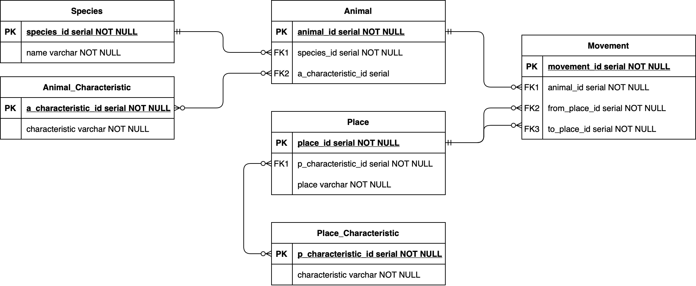

## Lab work #1

#### Данный текст задания (Предметная область)

**Вариант: 1350**

*Он добрался до входа в **пещеру** и на мгновение задержался на **узкой площадке** перед ним.
 Вокруг пахло **свежей кровью**, и этот запах будил в **убогом свирепом мозгу** **леопарда** одно **неудержимое желание**.
  Не колеблясь, зверь бесшумно **шагнул** в пещеру.*

#### Описание предметной области

Главной персонаж данного текста - Леопард. 
Нам даны несколько его характеристик: убогий свирепый мозг, неудержимо возбуждаем, непоколебим. 
Имея данную информацию введем следующие сущности:
* `Animal`
* `Animal_Characteristic`
* `Species`

`Animal` имеет отношение **М:1** к `Species` а так же **М:М** к `Animal_Characteristic`.

Также нам даны места и их описания в которых происходит действие. Введем сущности:
* `Place`
* `Place_Characteristic`

`Place` имеет отношение **М:М** к `Place_Characteristic`.

В конце концов в тексте описано перемещение (*шаг*) леопарда с площадки внутрь пещеры.
Последняя сущность:
* `Movement`

`Movement` имеет отношение **М:1** к животным совершающим движение и местам отправления и прибытия.

#### Построенная ER-Диаграмма

