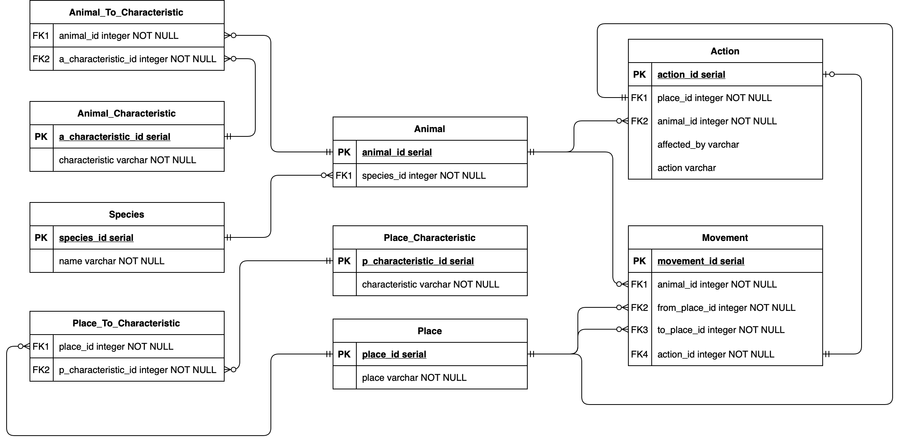

# Lab work #1

## Данный текст задания (Предметная область)

**Вариант: 1350**

*Он добрался до входа в **пещеру** и на мгновение задержался на **узкой площадке** перед ним.
 Вокруг пахло **свежей кровью**, и этот запах будил в **убогом свирепом мозгу** **леопарда** одно **неудержимое желание**.
  Не колеблясь, зверь бесшумно **шагнул** в пещеру.*

## Описание предметной области

Главной персонаж данного текста - Леопард. 
Нам даны несколько его характеристик: убогий свирепый мозг, неудержимо возбуждаем, непоколебим. 
Имея данную информацию введем следующие сущности:
* `Animal`
* `Animal_Characteristic`
* `Species`

`Animal` имеет отношение **М:1** к `Species` а так же **М:М** к `Animal_Characteristic`.

Также нам даны места и их описания в которых происходит действие. Введем сущности:
* `Place`
* `Place_Characteristic`

`Place` имеет отношение **М:М** к `Place_Characteristic`.

В конце концов в тексте описано перемещение (*шаг*) леопарда с площадки внутрь пещеры.
Последняя сущность:
* `Movement`

`Movement` имеет отношение **М:1** к животным совершающим движение и местам отправления и прибытия.

## Построенная ER-Диаграмма



## DDL

```sql
CREATE TABLE IF NOT EXISTS species (
    species_id SERIAL PRIMARY KEY,
    name VARCHAR NOT NULL
);

CREATE TABLE IF NOT EXISTS animal_characteristic (
    a_characteristic_id SERIAL PRIMARY KEY,
    characteristic VARCHAR NOT NULL
);

CREATE TABLE IF NOT EXISTS animal (
    animal_id SERIAL PRIMARY KEY,
    species_id INTEGER REFERENCES species (species_id)
);

CREATE TABLE IF NOT EXISTS animal_to_characteristic (
    animal_id INTEGER REFERENCES animal (animal_id),
    a_characteristic_id INTEGER REFERENCES animal_characteristic (a_characteristic_id)
);

CREATE TABLE IF NOT EXISTS place_characteristic (
    p_characteristic_id SERIAL PRIMARY KEY,
    characteristic VARCHAR NOT NULL
);

CREATE TABLE IF NOT EXISTS place (
    place_id SERIAL PRIMARY KEY,
    place VARCHAR NOT NULL
);

CREATE TABLE IF NOT EXISTS place_to_characteristic (
    place_id INTEGER REFERENCES place (place_id),
    p_characteristic_id INTEGER REFERENCES place_characteristic (p_characteristic_id)
);

CREATE TABLE IF NOT EXISTS movement (
    movement_id SERIAL PRIMARY KEY,
    animal_id INTEGER REFERENCES animal (animal_id),
    from_place_id INTEGER REFERENCES place (place_id),
    to_place_id INTEGER REFERENCES place (place_id)
);
```

## DML

```sql
-- Species
INSERT INTO species (species_id, name) VALUES (1, 'леопард');

-- Animal

INSERT INTO animal (animal_id, species_id) VALUES (1, 1);

-- Animal Characteristic

INSERT INTO animal_characteristic (a_characteristic_id, characteristic) VALUES
    (1, 'убогий свирепый мозг'),
    (2, 'неудержимо возбуждаем'),
    (3, 'непоколебим');

-- Association animal to animal_characteristic

INSERT INTO animal_to_characteristic (animal_id, a_characteristic_id) VALUES
    (1, 1),
    (1, 2),
    (1, 3);

-- Place

INSERT INTO place (place_id, place) VALUES
    (1, 'проход'),
    (2, 'пещера');

-- Place Characteristic

INSERT INTO place_characteristic (p_characteristic_id, characteristic) VALUES
    (1, 'узкий'),
    (2, 'пахнет свежей кровью');

-- Association place to place_characteristic

INSERT INTO place_to_characteristic (place_id, p_characteristic_id) VALUES
    (1, 1),
    (2, 2);

-- Movement

INSERT INTO movement (animal_id, from_place_id, to_place_id) VALUES (1, 1, 2);
```