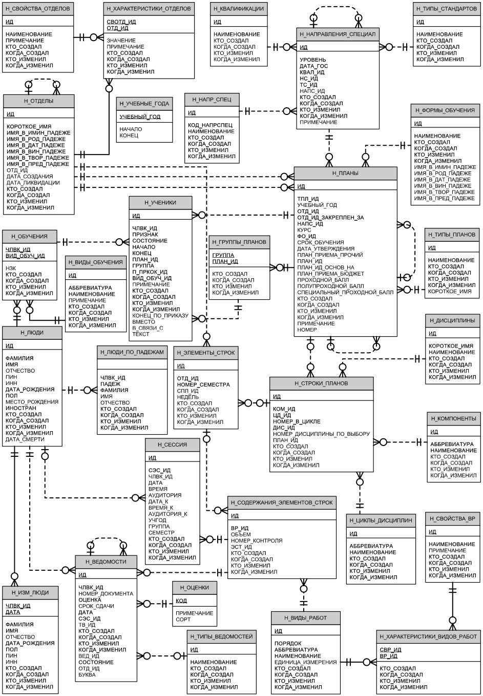

# Lab work #2

## Данный текст задания (Предметная область)

**Вариант: 625528**

Составить запросы на языке SQL (пункты 1-7).

1. Сделать запрос для получения атрибутов из указанных таблиц, применив фильтры по указанным условиям:
Таблицы: Н_ЛЮДИ, Н_СЕССИЯ.
Вывести атрибуты: Н_ЛЮДИ.ОТЧЕСТВО, Н_СЕССИЯ.ДАТА.
Фильтры (AND): 
a) Н_ЛЮДИ.ФАМИЛИЯ > Петров.
b) Н_СЕССИЯ.ИД > 32199.
Вид соединения: RIGHT JOIN.
2. Сделать запрос для получения атрибутов из указанных таблиц, применив фильтры по указанным условиям:
Таблицы: Н_ЛЮДИ, Н_ОБУЧЕНИЯ, Н_УЧЕНИКИ.
Вывести атрибуты: Н_ЛЮДИ.ОТЧЕСТВО, Н_ОБУЧЕНИЯ.НЗК, Н_УЧЕНИКИ.НАЧАЛО.
Фильтры: (AND)
a) Н_ЛЮДИ.ФАМИЛИЯ > Иванов.
b) Н_ОБУЧЕНИЯ.ЧЛВК_ИД = 163276.
c) Н_УЧЕНИКИ.ИД > 250098.
Вид соединения: RIGHT JOIN.
3. Составить запрос, который ответит на вопрос, есть ли среди студентов ФКТИУ те, кто старше 25 лет.
4. Выдать различные имена преподавателей и число людей с каждой из этих имен, ограничив список именами, встречающимися более 50 раз на кафедре вычислительной техники.
Для реализации использовать соединение таблиц.
5. Выведите таблицу со средними оценками студентов группы 4100 (Номер, ФИО, Ср_оценка), у которых средняя оценка не больше максимальной оценк(е|и) в группе 1101.
6. Получить список студентов, зачисленных после первого сентября 2012 года на первый курс очной формы обучения (специальность: Программная инженерия). В результат включить:
номер группы;
номер, фамилию, имя и отчество студента;
номер и состояние пункта приказа;
Для реализации использовать подзапрос с EXISTS.
7. Сформировать запрос для получения числа в группе No 3100 хорошистов.

## Инфологическая модель базы данных



## DML

#### Task 1

```sql
SELECT "Н_ЛЮДИ"."ОТЧЕСТВО", "Н_СЕССИЯ"."ДАТА"  FROM "Н_ЛЮДИ"
RIGHT JOIN "Н_СЕССИЯ" ON "Н_ЛЮДИ"."ИД" = "Н_СЕССИЯ"."ЧЛВК_ИД"
WHERE "Н_ЛЮДИ"."ФАМИЛИЯ" > 'Петров' AND "Н_СЕССИЯ"."ИД" > 32199;
```

`<empty>`

#### Task 2

```sql
SELECT "Н_ЛЮДИ"."ОТЧЕСТВО", "Н_ОБУЧЕНИЯ"."НЗК", "Н_УЧЕНИКИ"."НАЧАЛО" FROM "Н_ЛЮДИ"
RIGHT JOIN "Н_ОБУЧЕНИЯ" ON "Н_ОБУЧЕНИЯ"."ЧЛВК_ИД" = "Н_ЛЮДИ"."ИД"
RIGHT JOIN "Н_УЧЕНИКИ" ON "Н_УЧЕНИКИ"."ЧЛВК_ИД" = "Н_ЛЮДИ"."ИД"
WHERE (
    "Н_ЛЮДИ"."ФАМИЛИЯ" > 'Иванов' AND
    "Н_ОБУЧЕНИЯ"."ЧЛВК_ИД" = 163276 AND
    "Н_УЧЕНИКИ"."ИД" > 250098
);
```

`<empty>`

#### Task 3

```sql
SELECT "Н_ОТДЕЛЫ"."КОРОТКОЕ_ИМЯ",
       "Н_ЛЮДИ"."ФАМИЛИЯ",
       "Н_ЛЮДИ"."ДАТА_РОЖДЕНИЯ" FROM "Н_УЧЕНИКИ"
INNER JOIN "Н_ПЛАНЫ" on "Н_УЧЕНИКИ"."ПЛАН_ИД" = "Н_ПЛАНЫ"."ИД"
INNER JOIN "Н_ОТДЕЛЫ" on "Н_ПЛАНЫ"."ОТД_ИД" = "Н_ОТДЕЛЫ"."ИД"
INNER JOIN "Н_ЛЮДИ" on "Н_УЧЕНИКИ"."ЧЛВК_ИД" = "Н_ЛЮДИ"."ИД"
WHERE
    "Н_ОТДЕЛЫ"."КОРОТКОЕ_ИМЯ" = 'КТиУ' AND
    (CURRENT_TIMESTAMP - "Н_ЛЮДИ"."ДАТА_РОЖДЕНИЯ") > (interval '365 days' * 25);
```

| **"Н_ОТДЕЛЫ"."КОРОТКОЕ_ИМЯ"** | **"ФАМИЛИЯ"** | **"ДАТА_РОЖДЕНИЯ"** |
|----|----|----|
|КТиУ|Брюхов|1987-08-08 00:00:00.000000|
|КТиУ|Будяков|1988-10-19 00:00:00.000000|
|КТиУ|Гурин|1987-09-21 00:00:00.000000|
|КТиУ|Иванов|1988-09-08 00:00:00.000000|
|КТиУ|Киров|1988-07-06 00:00:00.000000|
|....|....|....|


#### Task 4

```sql
SELECT "ИМЯ", COUNT("ИМЯ") FROM "Н_ЛЮДИ"
INNER JOIN "Н_ОБУЧЕНИЯ" ON "Н_ЛЮДИ"."ИД" = "Н_ОБУЧЕНИЯ"."ЧЛВК_ИД"
INNER JOIN "Н_УЧЕНИКИ" ON "Н_ОБУЧЕНИЯ"."ЧЛВК_ИД" = "Н_УЧЕНИКИ"."ЧЛВК_ИД"
INNER JOIN "Н_ПЛАНЫ" ON "Н_УЧЕНИКИ"."ПЛАН_ИД" = "Н_ПЛАНЫ"."ПЛАН_ИД"
INNER JOIN "Н_ОТДЕЛЫ" ON "Н_ПЛАНЫ"."ОТД_ИД" = "Н_ОТДЕЛЫ"."ОТД_ИД"
WHERE "Н_ОТДЕЛЫ"."КОРОТКОЕ_ИМЯ" = 'ВТ'
GROUP BY "ИМЯ"
HAVING COUNT("ИМЯ") > 50
ORDER BY "ИМЯ";
```

| **"ИМЯ"** | **"COUNT"** 
|----|----|
|Александр|1262|
|Александра|95|
|Алексей|1029|
|Анастасия|89|
|Анатолий|85|
|Андрей|825|
|Анна|185|
|Антон|448|
|Артем|203|
|Вадим|92|
|Валерий|90|
|Василий|149|
|Виктор|118|
|....|....|

#### Task 5

```sql
SELECT "Н_ЛЮДИ"."ИД","ФАМИЛИЯ", "ИМЯ", "ОТЧЕСТВО", AVG("ОЦЕНКА"::NUMERIC) FROM "Н_ЛЮДИ"
INNER JOIN "Н_УЧЕНИКИ" ON "Н_УЧЕНИКИ"."ЧЛВК_ИД" = "Н_ЛЮДИ"."ИД" AND "Н_УЧЕНИКИ"."ГРУППА" = '4100'
INNER JOIN "Н_ВЕДОМОСТИ" ON "Н_ВЕДОМОСТИ"."ЧЛВК_ИД" = "Н_ЛЮДИ"."ИД" AND "ОЦЕНКА" ~ '^[0-9\.]+$'
GROUP BY "Н_ЛЮДИ"."ИД", "ФАМИЛИЯ", "ИМЯ", "ОТЧЕСТВО"
HAVING (
    SELECT AVG("GROUP".MARK)
    FROM (
            SELECT AVG("ОЦЕНКА"::numeric) as MARK
            FROM "Н_УЧЕНИКИ"
            INNER JOIN "Н_ВЕДОМОСТИ" ON
                "ОЦЕНКА" ~ '^[0-9\.]+$' AND
                "Н_УЧЕНИКИ"."ГРУППА" = '1101' AND
                "Н_УЧЕНИКИ"."ЧЛВК_ИД" = "Н_ВЕДОМОСТИ"."ЧЛВК_ИД"
         ) "GROUP"
) <= MAX("ОЦЕНКА"::NUMERIC);
```
|"ИД"|"ФАМИЛИЯ"|"ИМЯ"|"ОТЧЕСТВО"|"СРЕД_ОЦЕНКА"|
|----|----|----|----|----|
|120849|Аграновский|Денис|Владимирович|3.75|
|119434|Соловьев|Сергей|Леонидович|4.4313725490196078|
|147536|Кирсанов|Константин|Александрович|2.7727272727272727|
|138937|Михайлов|Василий|Владимирович|3.2352941176470588|
|....|....|....|....|....|

#### Task 6

```sql
SELECT "ГРУППА", "ЧЛВК_ИД", "ИМЯ", "ОТЧЕСТВО", "В_СВЯЗИ_С" FROM "Н_УЧЕНИКИ"
INNER JOIN "Н_ПЛАНЫ" on "Н_УЧЕНИКИ"."ПЛАН_ИД" = "Н_ПЛАНЫ"."ИД"
INNER JOIN "Н_ЛЮДИ" on "Н_УЧЕНИКИ"."ЧЛВК_ИД" = "Н_ЛЮДИ"."ИД"
INNER JOIN "Н_ОТДЕЛЫ" on "Н_ПЛАНЫ"."ОТД_ИД" = "Н_ОТДЕЛЫ"."ИД" and "Н_ОТДЕЛЫ"."КОРОТКОЕ_ИМЯ" = 'ПИиКТ'
WHERE EXISTS(
    SELECT "ИД" FROM "Н_ФОРМЫ_ОБУЧЕНИЯ"
    WHERE "НАИМЕНОВАНИЕ" = 'Очная' and "НАЧАЛО" > '01.09.2012'
);
```

`<empty>`

#### Task 7

```sql
SELECT "Н_ЛЮДИ"."ИД", "Н_ЛЮДИ"."ФАМИЛИЯ", "Н_УЧЕНИКИ"."ГРУППА" FROM "Н_УЧЕНИКИ"
INNER JOIN "Н_ЛЮДИ" ON "Н_УЧЕНИКИ"."ЧЛВК_ИД" = "Н_ЛЮДИ"."ИД" AND "Н_УЧЕНИКИ"."ГРУППА" = '3100'
INNER JOIN "Н_ВЕДОМОСТИ" ON "Н_ВЕДОМОСТИ"."ЧЛВК_ИД" = "Н_ЛЮДИ"."ИД" AND "ОЦЕНКА" ~ '^[0-9\.]+$'
WHERE "ОЦЕНКА"::numeric >= 4
GROUP BY "Н_ЛЮДИ"."ИД", "Н_ЛЮДИ"."ФАМИЛИЯ", "Н_УЧЕНИКИ"."ГРУППА";
```

|"ИД"|"ФАМИЛИЯ"|"ГРУППА"|
|----|----|----|
|120950|Комарова|3100|
|137853|Лаптева|3100|
|146060|Николаев|3100|
|146462|Эшалиев|3100|
|....|....|....|
