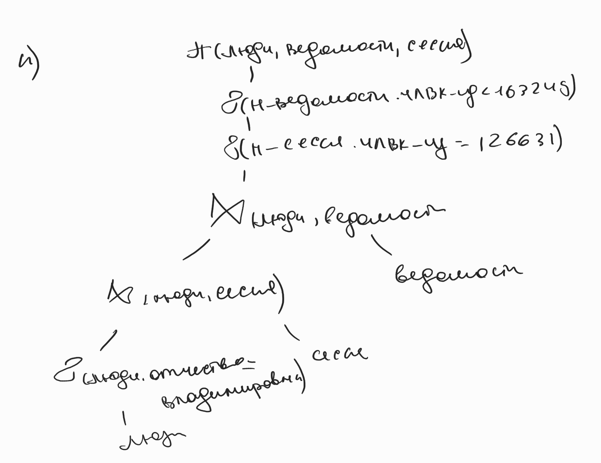

# Lab work #3

## Данный текст задания

**Вариант: 254178**

Составить запросы на языке **SQL**.

Для каждого запроса предложить индексы, добавление которых уменьшит время выполнения запроса (указать таблицы/атрибуты, для которых нужно добавить индексы, написать тип индекса; объяснить, почему добавление индекса будет полезным для данного запроса).

Для запросов `1`-`2` необходимо составить возможные планы выполнения запросов. Планы составляются на основании предположения, что в таблицах отсутствуют индексы. Из составленных планов необходимо выбрать оптимальный и объяснить свой выбор.
Изменятся ли планы при добавлении индекса и как?

Для запросов `1`-`2` необходимо добавить в отчет вывод команды `EXPLAIN ANALYZE` [запрос]

Подробные ответы на все вышеперечисленные вопросы должны присутствовать в отчете (планы выполнения запросов должны быть нарисованы, ответы на вопросы - представлены в текстовом виде).

1. Сделать запрос для получения атрибутов из указанных таблиц, применив фильтры по указанным условиям:
Таблицы: `Н_ОЦЕНКИ`, `Н_ВЕДОМОСТИ`.
Вывести атрибуты: `Н_ОЦЕНКИ.ПРИМЕЧАНИЕ`, `Н_ВЕДОМОСТИ.ИД`.
Фильтры **AND**:
a) `Н_ОЦЕНКИ.ПРИМЕЧАНИЕ` = **неудовлетворительно**.
b) `Н_ВЕДОМОСТИ.ЧЛВК_ИД` = **117219**.
Вид соединения: **INNER JOIN**.
2. Сделать запрос для получения атрибутов из указанных таблиц, применив фильтры по указанным условиям:
Таблицы: `Н_ЛЮДИ`, `Н_ВЕДОМОСТИ`, `Н_СЕССИЯ`.
Вывести атрибуты: `Н_ЛЮДИ.ФАМИЛИЯ`, `Н_ВЕДОМОСТИ.ДАТА`, `Н_СЕССИЯ.ДАТА`.
Фильтры **AND**:
a) `Н_ЛЮДИ.ОТЧЕСТВО` = **Владимирович**.
b) `Н_ВЕДОМОСТИ.ЧЛВК_ИД` < **163249**.
c) `Н_СЕССИЯ.ЧЛВК_ИД` = **126631**.
Вид соединения: **RIGHT JOIN**.

## Инфологическая модель базы данных


## DML


#### Task 1

```sql
SELECT "Н_ОЦЕНКИ"."ПРИМЕЧАНИЕ", "Н_ВЕДОМОСТИ"."ИД" FROM "Н_ОЦЕНКИ"
INNER JOIN "Н_ВЕДОМОСТИ" ON "ОЦЕНКА" = "КОД"
WHERE
    "Н_ОЦЕНКИ"."ПРИМЕЧАНИЕ" = 'неудовлетворительно' AND
    "Н_ВЕДОМОСТИ"."ЧЛВК_ИД" = 117219;
```

`<empty>`

#### Task 2

```sql
SELECT "Н_ЛЮДИ"."ФАМИЛИЯ", "Н_ВЕДОМОСТИ"."ДАТА", "Н_СЕССИЯ"."ДАТА" FROM "Н_ЛЮДИ"
RIGHT JOIN "Н_ВЕДОМОСТИ" on "Н_ЛЮДИ"."ИД" = "Н_ВЕДОМОСТИ"."ЧЛВК_ИД"
RIGHT JOIN "Н_СЕССИЯ" on "Н_ЛЮДИ"."ИД" = "Н_СЕССИЯ"."ЧЛВК_ИД"
WHERE
    "Н_ЛЮДИ"."ОТЧЕСТВО" = 'Владимирович' AND
    "Н_ВЕДОМОСТИ"."ЧЛВК_ИД" < 163249 AND
    "Н_СЕССИЯ"."ЧЛВК_ИД" = 126631;
```

`<empty>`

## Possible executions plans





## Indices

#### Index for task 1

```sql
-- NOT EFFECTIVE CREATE INDEX IF NOT EXISTS scores_desc_hash ON "Н_ОЦЕНКИ" USING hash("ПРИМЕЧАНИЕ");
CREATE INDEX IF NOT EXISTS reports_person_id_hash ON "Н_ВЕДОМОСТИ" USING hash("ЧЛВК_ИД");
```

#### Index for task 2

```sql
CREATE INDEX IF NOT EXISTS people_patronymic_hash ON "Н_ЛЮДИ" USING hash("ОТЧЕСТВО");
CREATE INDEX IF NOT EXISTS reports_person_id_hash ON "Н_ВЕДОМОСТИ" USING btree("ЧЛВК_ИД");
CREATE INDEX IF NOT EXISTS session_person_id_hash ON "Н_СЕССИЯ" USING btree("ЧЛВК_ИД");
```

## Analysis

#### Analysis for task 1


#### Analysis for task 2


