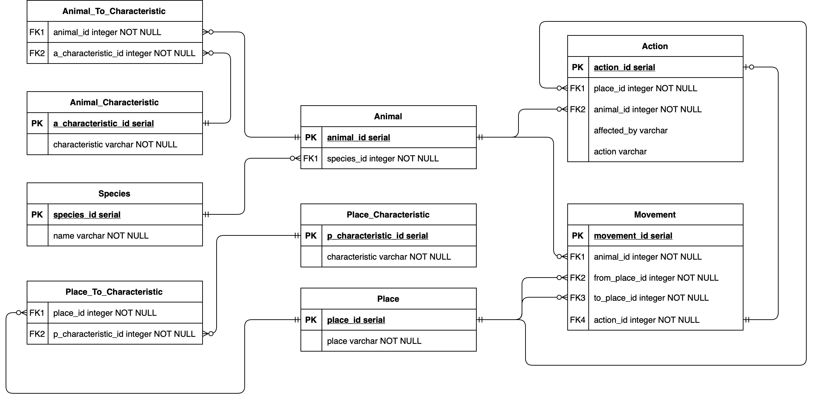
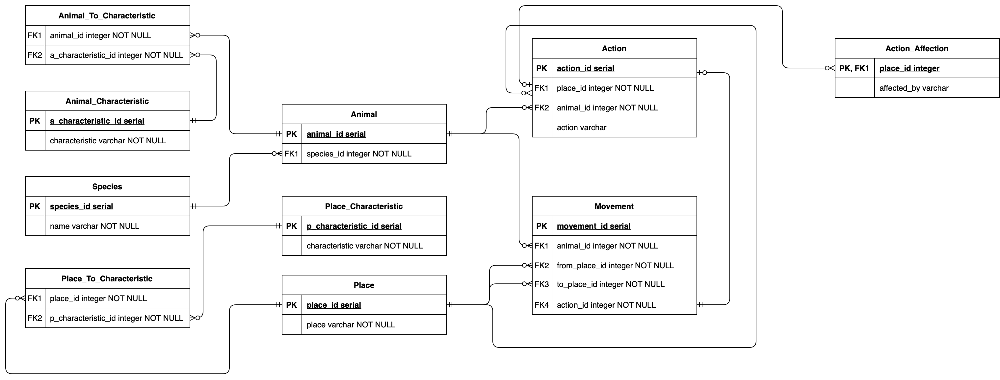
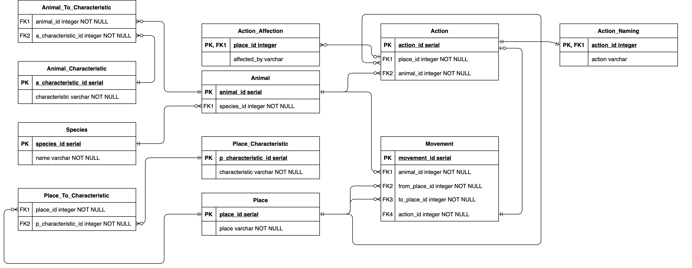

# Lab work #4

## Данный текст варианта (Предметная область)

*Он добрался до входа в **пещеру** и на мгновение задержался на **узкой площадке** перед ним.
 Вокруг пахло **свежей кровью**, и этот запах будил в **убогом свирепом мозгу** **леопарда** одно **неудержимое желание**.
  Не колеблясь, зверь бесшумно **шагнул** в пещеру.*

## Описание предметной области

Главной персонаж данного текста - Леопард. 
Нам даны несколько его характеристик: убогий свирепый мозг, неудержимо возбуждаем, непоколебим. 
Имея данную информацию введем следующие сущности:
* `Animal`
* `Animal_Characteristic`
* `Species`

`Animal` имеет отношение **М:1** к `Species` а так же **М:М** к `Animal_Characteristic`.

Также нам даны места и их описания в которых происходит действие. Введем сущности:
* `Place`
* `Place_Characteristic`

`Place` имеет отношение **М:М** к `Place_Characteristic`.

В конце концов в тексте описано перемещение (*шаг*) леопарда с площадки внутрь пещеры.
Последняя сущность:
* `Movement`

`Movement` имеет отношение **М:1** к животным совершающим движение и местам отправления и прибытия.

## Задание

* Опишите функциональные зависимости для отношений полученной схемы (минимальное множество);
* Приведите отношение в 3NF (как минимум). Постройте схема на основе полученных отношений.
* Опишите изменения в функциональных зависимостях, произошедшие после преобразования в 3NF.
* Приведите отношение в BCNF.
* Какие денормализации будут полезны для вашей схемы.

## Построенная ER-Диаграмма

### Изначально построенная схема

### 3NF

* `action_id -> place_id` AND `place_id -> affected_by` - транзитивная зависимость. Выносим в отдельную таблицу.

### BCNF

* `action_id (PK) -> (place_id, animal_id)` и наоборот. А вот `action varchar` тут не причем. Выносим в отдельную таблицу.

## Денормализация

Если не начинать хранить значения в списках и тем самым нарушать 1НФ, 
то единственную нормализацию которую я могу предложить - это не выносить `action` из таблицы `Action`.

## Вывод

Помимо, понял, прошел, узнал нового. Есть еще такая ремарка: выглядит так что при выполнении нормализации, 
помимо того что можно достаточно продуктивно можно разложить по полочкам и организовать схему БД, так же можно и сильно порезать перформанс, если наплодить кучу таблиц. 
Так что по итогу стоит искать какой-то компромисс между один и другим.  